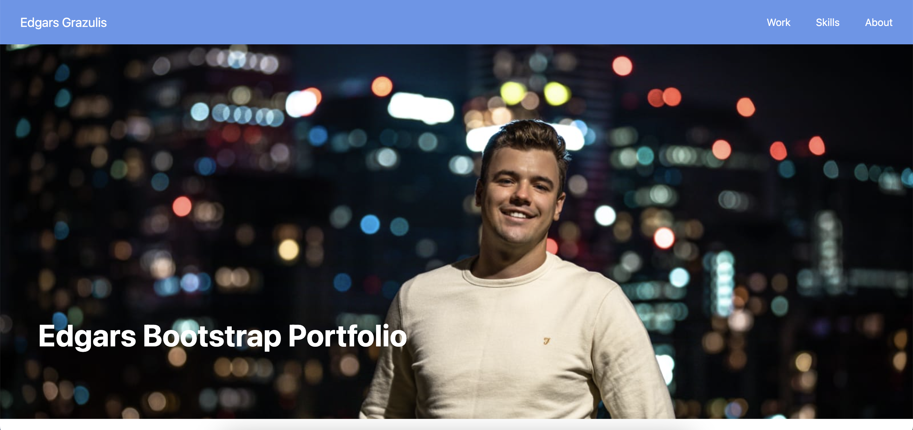
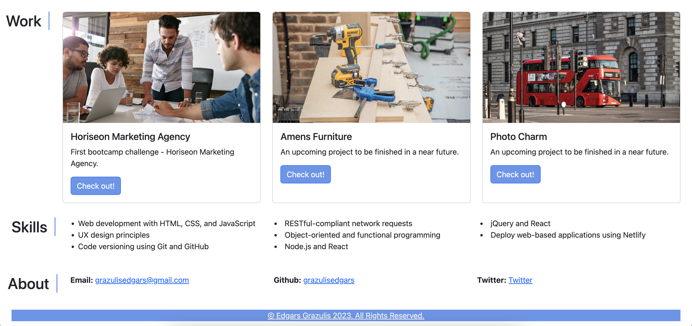

# Edgars-Bootstrap-Portfolio

## Description

Third Challenge - Edgars Bootstrap Portfolio. The further we go the more challenging it gets. This time no starter code and just set of instructions. Overall, I enjoyed working on this site even though I ran into some problems.

Before starting I'm using https://getbootstrap.com/docs/5.3/getting-started/introduction/ resource to set up Bootstrap on my HTML by adding CSS and JavaScript links.

Additionally to that I was usinng https://getbootstrap.com resources to create a nav bar, jumbotron, cards section and a row with columns to list skills and contact me section items. 

I did run into some problems with my nav bar. I was trying to get my nav links to the right side. I read blogs and looked at different kinds of solutions but I was not able to find one. After a while I asked ASK BCS Leaarning assistant and the person was able to help me out. I've commennted out the code he provided. 

Another thing I noticed was that the website loads differently on different browsers. On Google Chrome site looks amazing, but on Safari h2 heading doesn't float to the left as I would like to. 

While working on this challenge I referred back to http://w3schools.com/ https://developer.mozilla.org/en-US/ resources to find the right way how to present code. 

## Link
https://grazulisedgars.github.io/Edgars-Bootstrap-Portfolio/ 

## Previous Showcase-Portfolio Link

https://grazulisedgars.github.io/Edgars-Showcase-Portfolio/

## Screenshots

## Licence 

MIT